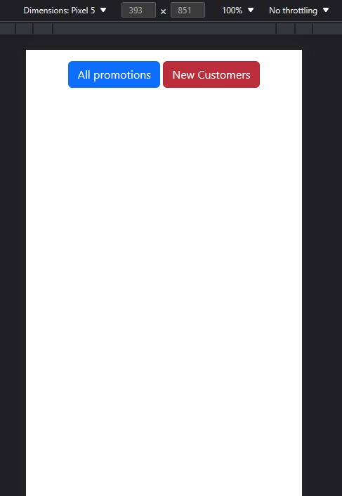
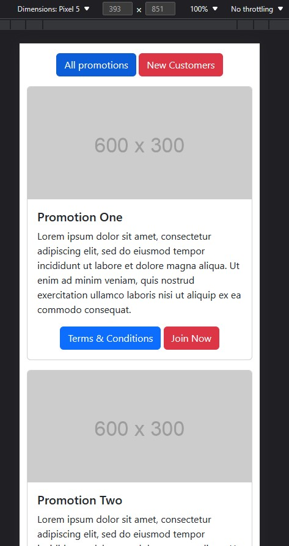
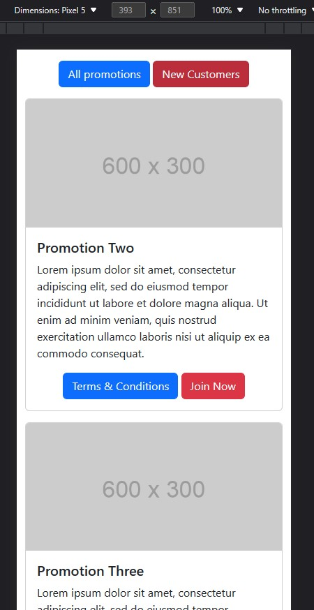

# Desafio FrontEnd - Addison Global

Este repositório contém a solução para o desafio de frontend que se encontra [aqui](https://github.com/addisonglobal/web-technical-test).

A stack desse projeto é apenas HTML, CSS e JavaScript.

## Solução

O desafio exigia a criação de uma página da web com dois botões que exibem diferentes conjuntos de ofertas promocionais ao serem clicados. 

As ofertas promocionais foram obtidas de uma API fictícia usando a função fetch do JavaScript.

## Visão Geral

Adicionando-se que o design é **mobile-first**, por isto foi escolhido como CSS o uso do Boostrap.

O código da solução tem dois eventos para os dois botões presentes na página da web. 

Quando o botão "All Promotions" é clicado, a função fetch é usada para obter dados da API fictícia, e os dados são exibidos na página da web.

Da mesma forma, quando o botão "New Customers" é clicado, a função fetch é usada novamente para obter dados da API, mas desta vez apenas as promoções para novos clientes são exibidas.

Para cada oferta promocional, um cartão é criado e adicionado à página da web usando String Literals do JavaScript.

## Conclusão

Esta solução demonstra um exemplo básico de como buscar dados de uma API e exibi-los dinamicamente em uma página da web usando JavaScript. O código é limpo e conciso, e o layout da página da web é visualmente atraente.