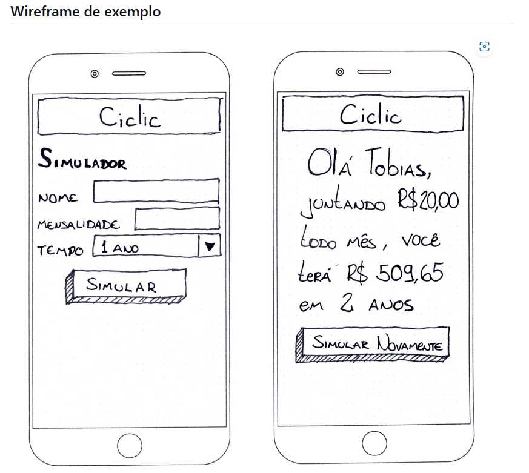
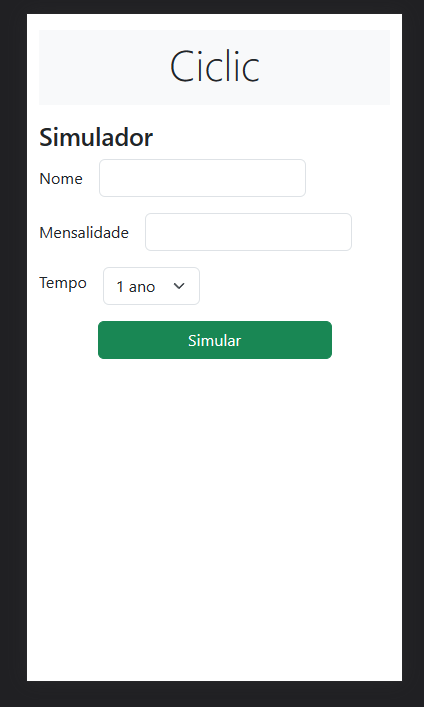
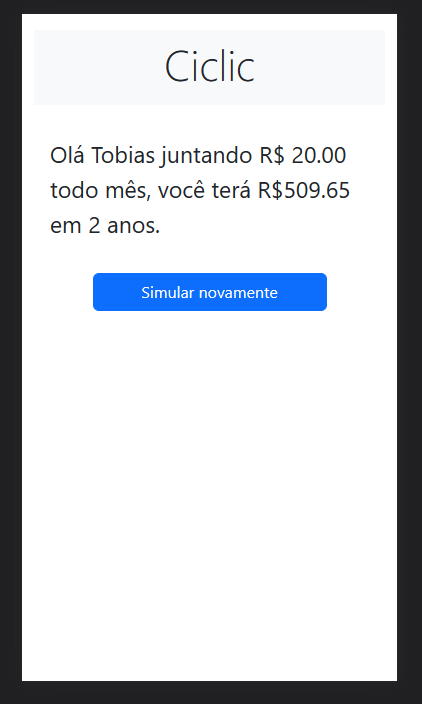

# Ciclic Frontend Challenge

Este repositório é referente ao desafio de frontend proposto pela [empresa Ciclic](https://github.com/ciclic/test-frontend).

O objetivo é desenvolver uma aplicação que calcule o montante acumulado a partir de uma aplicação financeira. O cálculo é feito através de uma API que recebe os valores de investimento mensal e duração, e retorna o valor acumulado após o período.

## Stack Utilizada

JavaScript puro para a lógica e Bootstrap no CSS.
Foi utilizado `async/await fetch` para a requisição à API.

## Instruções para execução

1. Clone o repositório em sua máquina local
2. Abra o `index.html` em um navegador web.

## Descrição da Aplicação

A aplicação é simples e consiste em um formulário onde o usuário insere o valor do investimento mensal e o tempo de duração em anos. Ao enviar o formulário, é feita uma requisição à API e o valor acumulado é retornado.

O resultado é exibido na página em um card, juntamente com uma mensagem personalizada para o usuário. O usuário pode simular novamente clicando no botão "Simular novamente".

 

## Considerações Finais

O desafio foi concluído com sucesso e foi uma ótima oportunidade para aprimorar os conhecimentos em desenvolvimento frontend utilizando Vanilla JS e Bootstrap. 

Qualquer dúvida ou sugestão, por favor, entre em contato.